This article is going to be a short list of all the articles that I had written as an intern at IoTEDU. Feel free to read them and reach out to me in case you have any questions.  
  
## Articles

- [**Tutorial on Google IoT Core with Raspberry Pi to visualize the sensor data.**](https://iot4beginners.com/tutorial-on-google-iot-core-with-raspberry-pi-to-visualize-the-sensor-data/) 
  
  
- [**Tutorial on AWS IoT Core with Raspberry Pi to visualize sensor data**](https://iot4beginners.com/tutorial-on-aws-iot-core-with-raspberry-pi-to-visualize-sensor-data/) 
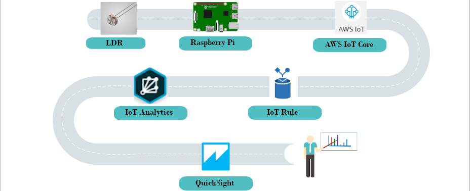  
  
- [**Messaging protocols for IoT – A Comparison**](https://iot4beginners.com/messaging-protocols-for-iot-a-comparison/) 
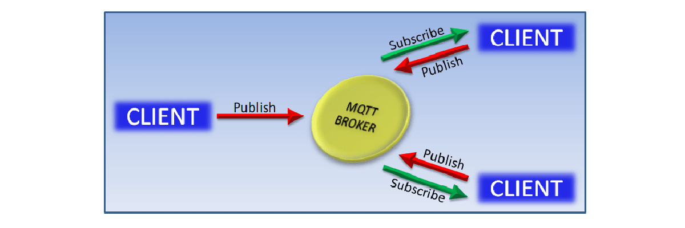  
  
- [**Market Analysis With Computer Vision and IoT**](https://iot4beginners.com/market-analysis-with-computer-vision/) 
  
  
- [**Creating a Raspberry Pi Network Scanner**](https://iot4beginners.com/creating-a-raspberry-pi-network-scanner/) 
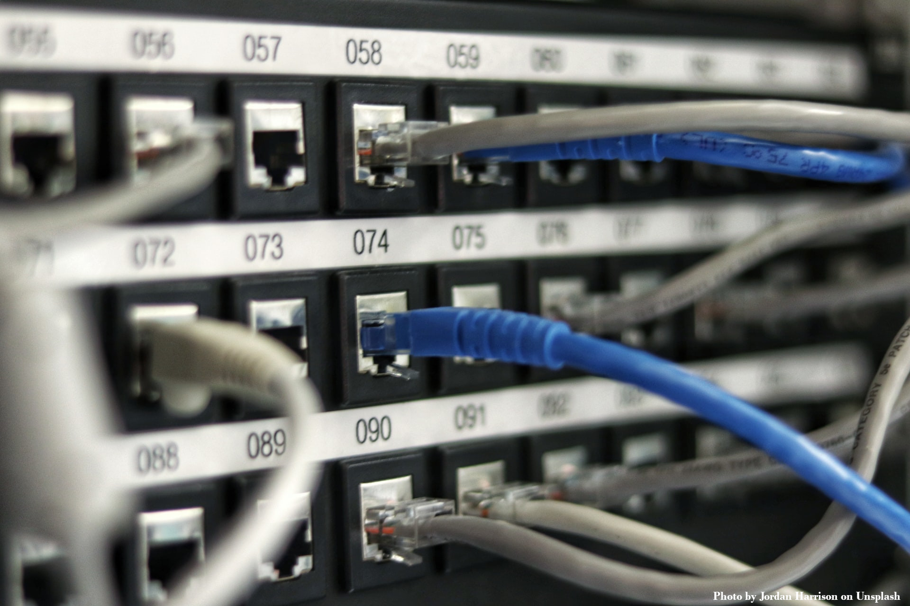  
  
- [**Route Planning for Garbage collection with IoT**](https://iot4beginners.com/route-planning-for-garbage-collection-with-iot-part-1/) 
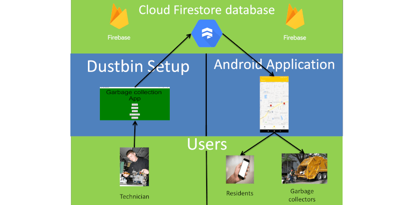  
  
- [**Temperature sensor with Raspberry Pi (DS18B20)**](https://iot4beginners.com/temperature-sensor-with-raspberry-pi-ds18b20/) 
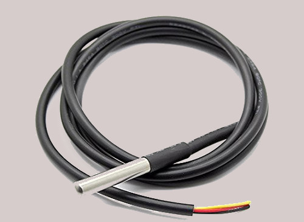  
  
- [**Azure IoT Hub & SQL With Python – A Tutorial**](https://iot4beginners.com/azure-iot-hub-sql-with-python-a-tutorial/) 
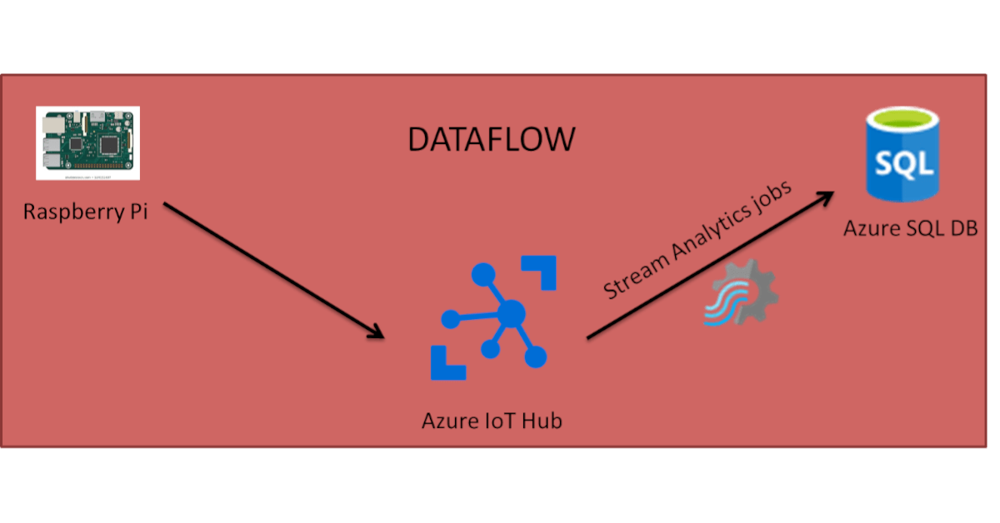  
  
- [**Evolution of the Raspberry Pi – A Comparison**](https://iot4beginners.com/evolution-of-the-raspberry-pi-a-comparison/) 
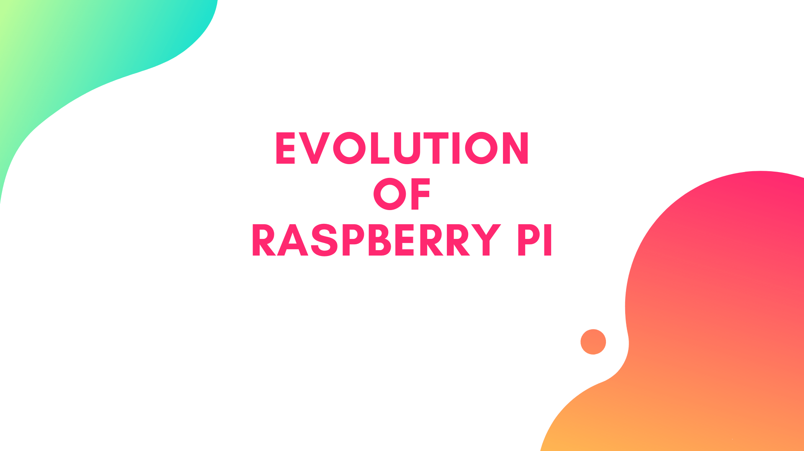  
  
- [**Home Automation With Telegram and Raspberry Pi**](https://iot4beginners.com/home-automation-with-telegram-and-raspberry-pi/) 
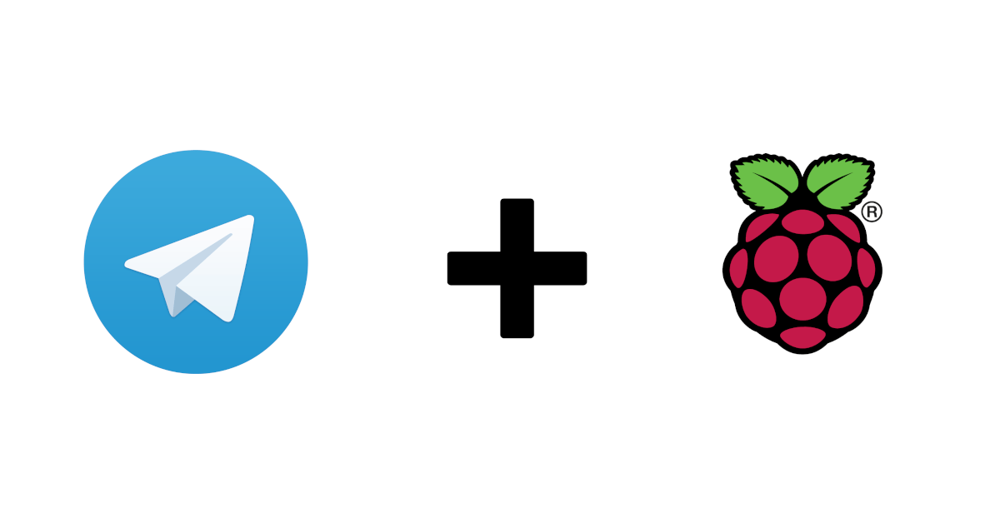  
  
- [**Django vs Flask – A Comprehensive Analysis**](https://iot4beginners.com/django-vs-flask-a-comprehensive-analysis/) 
  
  
- [**What is Big Data and How is it Used in the Real World?**](https://iot4beginners.com/what-is-big-data-and-how-is-it-used-in-the-real-world/) 
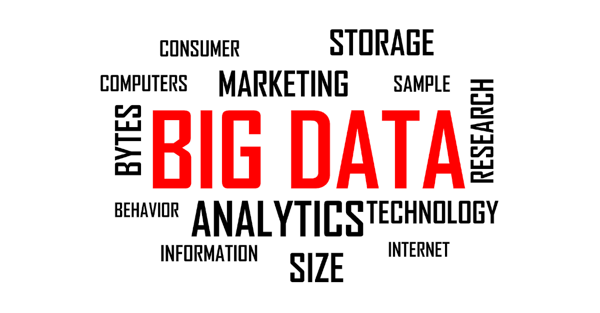  
  
- [**How Does RFID Work and Where Do We Use It?**](https://iot4beginners.com/how-does-rfid-work-and-where-do-we-use-it/) 
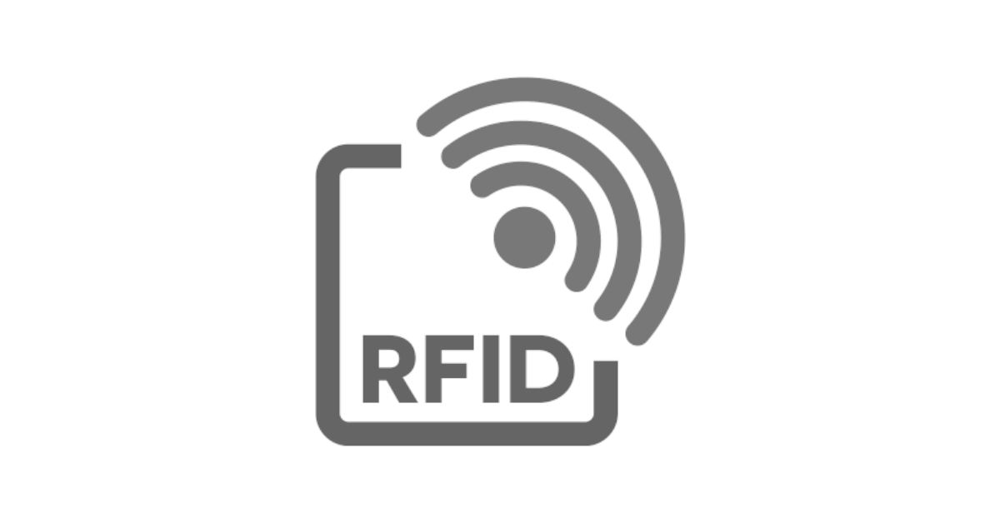  
  
- [**Most Commonly Used Web Frameworks**](https://iot4beginners.com/most-commonly-used-web-frameworks/) 
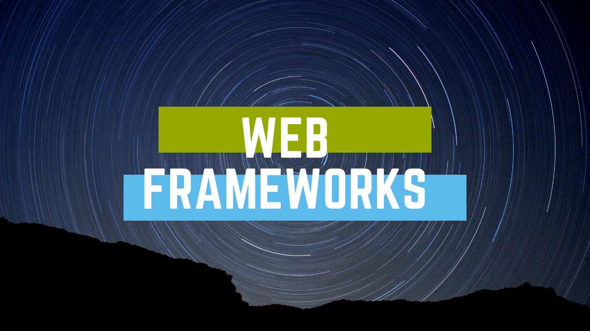  
  

