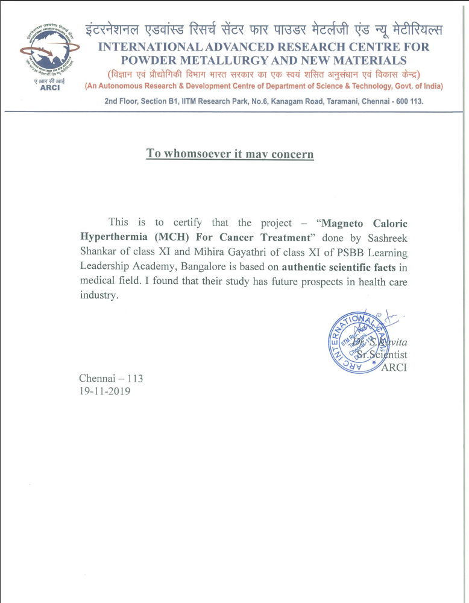

In this article we will look at a research project of mine that could probably become a supplementary treatment to present day cancer treatments such as chemotherapy or radio-therapy (if it hasn't been developed secretivley in a lab somewhere already). The purpose of this is to increase the overall efficiency of cancer treatments per sitting.  
The basic principle of this treatment is the magneto caloric effect. Which is the heating or cooling of a magnetic material when the applied magnetic field changes.  
I have built the prototype that demonstrates the working of the treatment on a macro scale. The full research document is in the PDF document below.  
We had also interviewed Dr. Anitha Gopinath a Senior consultant in oncology at Apollo Hospitals in Bangalore to clarify certain findings we researched and also to see what an Oncologist had thought about our idea.  
  
**You can see the entire interview embeded at the bottom of the article.**
  
## Materials Used
- Raspberry Pi 3
- Temperature sensor( DS18B20 )
- 9v DC pump
- LEDs
- 16x2 LCD display
- L293D motor driver  
  
**NOTE : - A detailed explanation of the concept and the prototype can be found in the PDF file**
  
<a href="files/synopsis.pdf" target="_blank"></img></a>

<a href="files/synopsis.pdf" target="_blank">Click on the icon to view the PDF file</a>

## Certification from ARCI
<a href="files/cert.pdf" target="_blank"></img></a>

<a href="files/cert.pdf" target="_blank">Click on the image to view the certificate</a>

## Interview of Dr Anitha Gopinath


